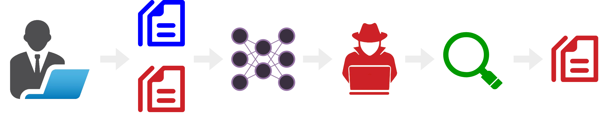

# Language Model Data Extraction with Region-Constrained Beam Search

## 🚀 Quick Start
```bash
# Using Ubuntu 24.04, Python 3.10, PyTorch 2.6 and CUDA 12.2
snap install nvtop
python3 -m venv .venv
source .venv/bin/activate
pip install -r requirements.txt
huggingface-cli login
huggingface-cli download meta-llama/Llama-3.1-8B-Instruct
# Run attack.ipynb
```

## 👋 Overview

**Example Attack Scenario:**
1. A user gathers training code for a language model, accidentally including a private key in the data.
2. The user trains a language model on the data.
3. The user releases the trained model to the public. The training data is not released to the public.
4. An attacker downloads the model and searches for keys using region-constrained beam search.
5. The attacker extracts the private key from the model.

**Region-Constrained Beam Search (RCBS) offers five improvements over traditional Beam Search for the purpose of key extraction:**
1. It constrains the search space to the key's vocabulary.
2. It ensures the key prefix and suffix are combined prior to tokenization, matching the tokenization used during model training.
3. It separates tokens into regions to encourage search diversity.
4. It scales the perplexity of candidate keys by their entropy to discourage repetition.
5. It uses a stride (look-ahead) to overcome local optima in the search space.

## 🌳 Repo Layout
- **attack.ipynb** - proof of concept key extraction attack
- **objective.py** - perplexity, entropy, and hamming distance functions
- **evolution/** - genetic algorithm experiments

## 📚 Related Work
1. [Extracting Training Data from Large Language Models](https://www.usenix.org/system/files/sec21-carlini-extracting.pdf), Usenix 2021
1. [Training Data Extraction Survey](https://aclanthology.org/2023.trustnlp-1.23.pdf), TrustNLP Workshop 2023
1. [Scalable Extraction of Training Data from Aligned, Production Language Models](https://openreview.net/pdf?id=vjel3nWP2a), ICLR 2025
1. [Quantifying Memorization in Large Language Models](https://openreview.net/pdf?id=TatRHT_1cK), ICLR 2023
1. [When is memorization of irrelevant training data necessary for high-accuracy learning?](https://dl.acm.org/doi/abs/10.1145/3406325.3451131), ACM STOC 2021
1. [How Much Do Code Language Models Remember? An Investigation on Data Extraction Attacks before and after Fine-tuning](https://arxiv.org/pdf/2501.17501), MSR 2025
1. [Membership Inference Attacks against Language Models via Neighbourhood Comparison](https://aclanthology.org/2023.findings-acl.719/), ACL 2023
1. [A Thorough Examination of Decoding Methods in the Era of LLMs](https://aclanthology.org/2024.emnlp-main.489/), EMNLP 2024
1. [Genetic-Based Decoder for Statistical Machine Translation](https://link.springer.com/chapter/10.1007/978-3-319-75487-1_9), Springer 2018
1. [Preventing Generation of Verbatim Memorization in Language Models Gives a False Sense of Privacy](https://aclanthology.org/2023.inlg-main.3/), INLG 2023
1. [Grammar-Constrained Decoding for Structured NLP Tasks without Finetuning](https://aclanthology.org/2023.emnlp-main.674/), EMNLP 2023
1. [Diverse Beam Search: Decoding Diverse Solutions from Neural Sequence Models](https://openreview.net/forum?id=HJV1zP5xg)
